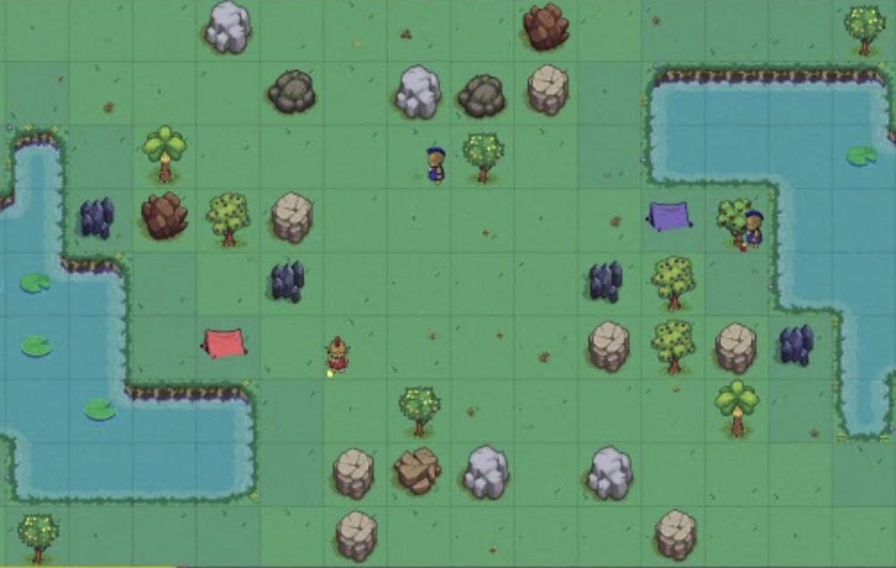

# Spring Challenge 2026 - Troll Farm

<!--  --> 

## 🎯 Goal

Control your troll pack and gather as many resources as possible before the game ends.

[📂 Official Contest Website](https://www.codingame.com/contests/spring-challenge-2026-troll-farm) 

<!-- [📂 Game Rules](docs/Game-Rules.md?plain=1) -->

## 🧠 Solution Approach

- Iterative improvement using insights from Claude Sonnet 4.6 and Lumo 1.3.

🪵 **League Wood 2 to League Wood 1:**
- Started from the default starter bot and progressively improved decision-making logic.
- Used iterative testing with Claude to refine troll behavior (harvest).
- Focused on the core gameplay loop: collect fruits → return to shack → repeat efficiently.
- Added autonomous action selection for each troll:
  
  → Return to shack when carrying resources
  
  → Harvest when standing on a fruit tree

  → Move toward the nearest productive tree

  → Idle smartly when no fruit is available
  
🥉 **League Wood 1 to League Bronze:**
- Added economic expansion logic with adaptive troll training based on available resources and game progression.
- Implemented early-game planting strategy to increase long-term fruit production before switching to full harvesting mode.

🥈 **League Bronze to League Silver:**
- Introduced value-based target scoring to prioritize the most profitable actions per turn.
- Added multi-troll coordination with target deduplication, resource-aware training logic, and specialized late-game decision handling.

## 🛠️ Tech Stack

Python 3.11
- No external dependencies
- Grid-based simulation
- Manhattan-distance targeting

## 🚀 How to Run & Test

🪵 **League Wood 2 to League Wood 1:**

**Development workflow:**
- Started from the official starter code
- Added movement, harvesting, and drop logic incrementally
- Iterated directly through the challenge arena and replay system
  
**Testing:**
- Verified troll state transitions:

  → moving

  → harvesting

  → returning resources

- Observed replay behavior against opponents and adjusted targeting priorities
  
**Validation:** 
- Successfully climbed from Wood 2 to Wood 1 league
- Confirmed stable autonomous gameplay without invalid commands or timeouts

🥉 **League Wood 1 to League Bronze:**

**Development workflow:**
- Added planting and training logic incrementally
  
**Testing:**
- Verified troll state transitions:

  → planting

  → training new trolls

- Adjusted planting and expansion timing
  
**Validation:**
- Successfully climbed from Wood 1 to Bronze league
- Validated that early planting improved long-term resource generation in extended matches

🥈 **League Bronze to League Silver:**

**Development workflow:**
- Incrementally added chopping and mining behaviors
- Tuned action scoring and resource priorities based on match outcomes

**Testing:**
- Verified multi-troll coordination and target assignment logic
- Validated late-game return behavior

**Validation:**
- Successfully climbed from Bronze league to Silver league
- Confirmed improved resource efficiency and reduced troll idle time

## ⚖️ Design Trade-offs

🪵 **League Wood 2 to League Wood 1:**
- **Simplicity > Complexity**: Used nearest-tree targeting instead of predictive simulation
- **Reliable actions first**: Prioritized always-valid commands over aggressive optimization
- **Distance-based selection**: Fast and deterministic under strict turn limits
- **Single-turn reasoning**: No deep future planning to keep execution lightweight
- **No pathfinding**: Relied on arena movement resolution instead of implementing BFS/A*
- **Rapid iteration workflow**: Improvements validated directly through arena progression and replay analysis
  
🥉 **League Wood 1 to League Bronze:**
- **Economic scaling over optimization**: Focused on increasing troll count and tree availability rather than perfect per-turn efficiency
- **Heuristic planting strategy**: Triggered planting mode using simple thresholds instead of map-wide resource forecasting

🥈 **League Bronze to League Silver:**
- **Controlled complexity**: Added strategic systems while keeping the code single-file and contest-safe
- **Greedy coordination**: Trolls coordinate through target reservation rather than global optimization
- **Resource specialization**: Dynamically shifts between fruits, wood, and iron depending on training needs

<!-- ## 🏆 Competition Results

test -->

<!-- 🥉 **Bronze League**: [Code Winner](code/1st-version-Bronze.md?plain=1) --> 

<!-- **Silver League**: [Code #183 of a total of 1,119 🥈](code/1st-version-Argent.md?plain=1) --> 

## Contact
LinkedIn : [Francesca Oliveira](https://www.linkedin.com/in/oliveirafrancesca/)

Email : fran.odc@pm.me

*Dernière mise à jour : Mai 2026*
